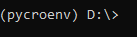

# mamcti-2.0
Code Repository for Microscope Stage Automation for Multiple-location Chamber Time-lapse Imaging (mamcti)

## Quick To-Do
| Task  | Status | Type |
| ------------- |:-------------:|:-------------:|
| Compile to Executable             | Not Done |  Late-Development |
| PyCro Dependency Check            | Not Done |  Early-Development |
| ML/AI Python script injection     | Not Done |  Early-Development |
| Basic Microscopic Movement        | Done     |  Early-Development |
| Unit Test Pipeline                | Not Done |  DevOps |
| Integration Test Pipeline         | Not Done |  DevOps |
| Contour Detection                 | Not Done |  AI/ML Issue |
| Edge Detection                    | Not Done |  AI/ML Issue |


## Dependencies
### Application dependencies
* Python >= 3.10
* Tkinter (included in python official release)
* 
### ML/AI dependecies
* OpenCV2
* Mahotas

## Starting the MAMCTI application (Dev env) using the lab computer located in CILSE.
> This section assumes the usage of Nikon Eclipse TI2 Microscope, but this application should be generalized to most microscopic hardware.

This section details how to run the application in a development environment. This section also assumes that pycromanager's config file is successfully made and configured to your micrscopes configurations. **You must have pycromanager opened as well.**

### 1.) Open and Configure Anaconda Navigator
Anaconda Navigator should be installed on this desktop. If not, then you can find it here:
https://docs.anaconda.com/navigator/index.html

> Idea: We are using Anaconda Navigator to create a virtual environment so we can organize our projects libraries and such. Anaconda Navigator provides a nice GUI for creating environments managed by the Anaconda environment. However, you are always welcome to use your preferred CLI to conduct these steps. 


Once the application is open, make sure to switch to the pycroenv virtual environment as shown below by clicking on the play button.


If such an environment does not exist. Then create one by clicking on the create button at the bottom of Anaconda Navigator. Note that you will have to do conda install for missing dependencies.

By clicking the play button, select "Open in terminal". This should open up a cmd command prompt as shown below.


Naturally, verify your terminal is in the correct chosen environment through your CMD header. For example, we can see that for our pycroenv virtual environment, the header is depicted as:
```
(pycroenv) C:\Users\Boston Microscopes> _   
```
while a base or default environment is expressed as:
```
C:\Users\Boston Microscopes> _   
```

### 2.) CD to target directory
In your CMD, cd to your target directory. In the case of the CILSE computer we must switch to the D Drive with in the command prompt:
```
d: …
```
to which the expected output is:



Once on the correct drive, change directory into the target directory (cd). A fast way is to use file explorer to get the address of the target folder as text as shown below.


then paste it into the cmd similar to below:
```
cd D:\CIDAR\Sam\Zach\mamcti\mamcti-2.0\mamcti
```
 > You can use "dir" command to verify you are in the correct file location.
 
 
### 3.) Run the application
In your CMD prompt, run the following command to bootstrap the application.
```
python main.py
```


The application should open as seen below:


## Figure Dump
Below are some figures that are generated for the purposes fo this research project.

<br>
